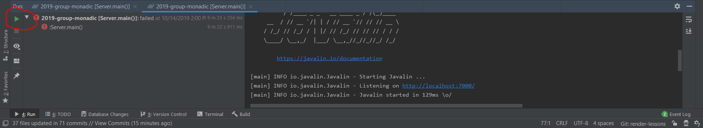
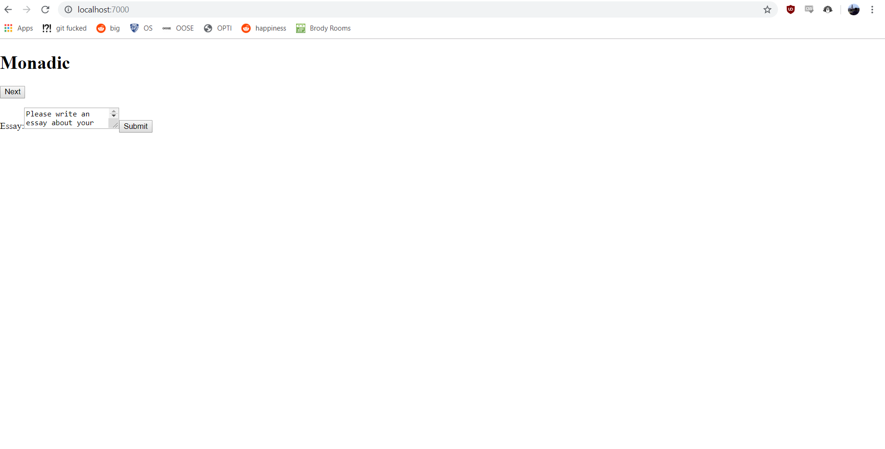

# Monadic

To run:

In IntelliJ, click the green (run program) button in Server.java.

Once the server (and javalin, and other associated build files) starts, navigate to [localhost:7000](http://localhost:7000)
in the browser. This is where the code should be running.

