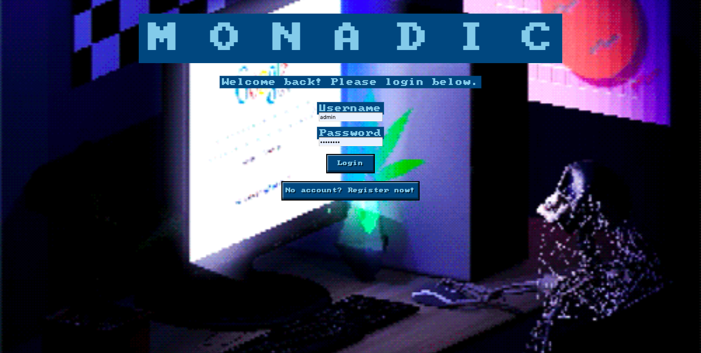
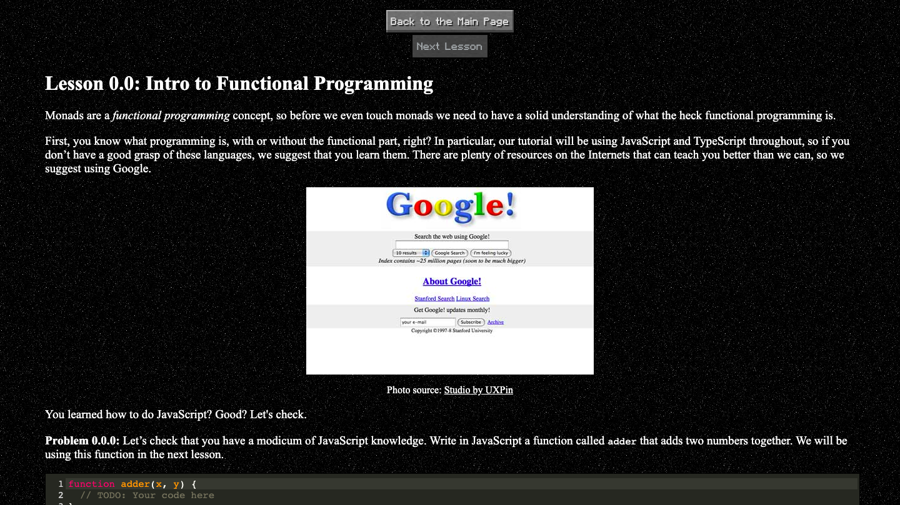

# Monadic

## Getting Started
This application can be run in Google Chrome. 
[Click here to launch the web application.](https://jhumonadic.herokuapp.com/)

## Registering for a New Account
On the home page, you should be given the option to enter a username and password. Complete this form and then click the 
"Register" button.

## Signing Into an Existing Account
If you already have an account, click the "Already Registered? Login!" button on the home page. 

You should then be given the option to enter your username and password. Complete this form and then click the "Login" 
button.

## Selecting a Lesson
After registering or logging in, you should see a page with a list of available courses, similar to the list below. 
*NOTE:* The available courses that you see might be different depending on your course progression. More courses and 
lessons will become visible as you progress through different lessons. 

Select the course you would like to take. You should then see a list of available lessons from the course, similar to 
the list below. *NOTE:* as described above, the available lessons that you see might be different depending on your 
lesson progression. More courses and lessons will become visible as you progress through different lessons. 

Select the lesson that you would like to take. You should then find yourself on the lesson page, like below.

