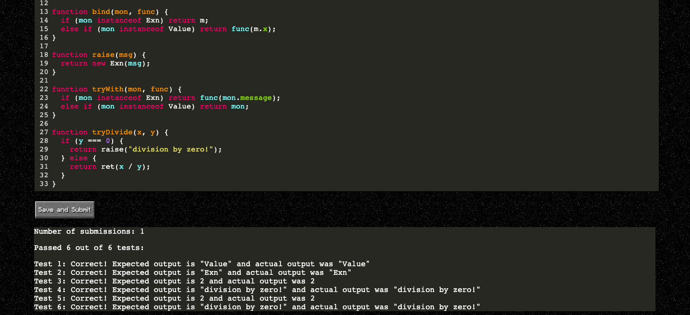

# Monadic

## Getting Started
This application can be run in Google Chrome. 
[Click here to launch the web application.](https://jhumonadic.herokuapp.com/)

## Registering for a New Account
On the home page, you should be given the option to enter a username and password. Complete this form and then click the 
"Register" button. Your username must be at least one character long and your password must be at least eight characters
long. You will be alerted if your desired username is already taken and will have to select another username.

## Signing Into an Existing Account
If you already have an account, click the "Already Registered? Login!" button on the home page. 

You should then be given the option to enter your username and password. Complete this form and then click the "Login" 
button.

## Selecting a Lesson
After registering or logging in, you should see a page with a list of available courses, similar to the list below. 
**NOTE:** The available courses that you see might be different depending on your course progression. More courses and 
lessons will become visible as you progress through different lessons. 

Select the course you would like to take. You should then see a list of available lessons from the course, similar to 
the list below. **NOTE:** as described above, the available lessons that you see might be different depending on your 
lesson progression. More courses and lessons will become visible as you progress through different lessons. 

Select the lesson that you would like to take. You should then find yourself on the lesson page, like below.

## Saving and Submitting Coding Activities
Some lessons include short coding activities to reinforce concepts taught during the lesson. These coding activities are
crucial to your understanding of monads and how to apply them in functional programming languages. After you complete a
coding activity, you can click the "Save and Submit" button to save and receive feedback on your work. There is no limit
to the number of times you can save and submit your work, but you will see a counter indicating how many times you have
submitted for each activity. 

## Works Cited

Course 1 is based off of the blog post ["No really, what's a monad?"](https://rmarcus.info/blog/2016/12/14/monads.html) by Ryan Marcus.

Courses 2, 3, and 4 are based off of material from the course ["Functional programming and type systems"](https://xavierleroy.org/mpri/2-4/), taught by OCaml developer [Xavier Leroy](https://xavierleroy.org/teaching.html). In particular, the Exception, State, and Continuation monads are mainly TypeScript re-implementations of monads that Leroy originally implemented in OCaml.

The buttons were inspired by these Minecraft buttons: ["Minecraft Style Menu & Buttons"](https://codepen.io/joexmdq/pen/EOMLzg) by [Joel](https://codepen.io/joexmdq)
