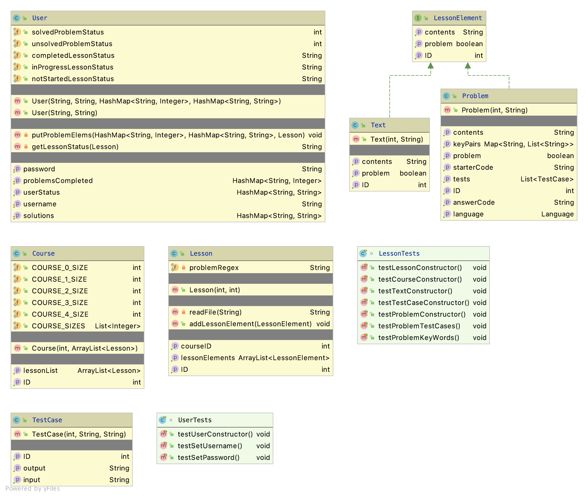

# Design

# Architecture

<!-- Is this a web application, a mobile application (React Native, iOS, Android?), a desktop application, and so forth? How do the different components (client, server, and so forth) communicate? Don’t simply list tools; tell a story. -->
According to the assignment "If you’re using only the tools in the Toolbox, then this section may be the same as the Architecture Overview: “We’re using the tools in Toolbox.”"

So, here we have it: We're using the tools in the Toolbox.

## Tools Outside the Toolbox

<!-- For each tool: What is it? Why did you choose it? Where do you get it? How do you learn it? Follow the model of how we presented the tools in the Toolbox. Cute original drawings encouraged. -->
We are not using tools outside the toolbox.

# Class Diagram



## Design Principles

Don't Repeat Yourself (DRY): This principle states that code should not repeat itself unnecessarily. In our code base, 
we have two types of answers: the CanonicalAnswer, which represents the actual Answer to the Problem, and the 
StudentAnswer, representing the student's response to the problem. Each answer uses identical constructors and getter
methods, so instead of repeating these methods, we simply created an Answer class which is a parent class for each of
these sub-classes. This way, we can define the constructor and getter functionality in the parent class, without 
repeating this code throughout the sub-classes.

Keep It Simple Stupid (KISS): This principle states that we shouldn't worry about designing code if we can simply use a
pre-written library, reducing the amount of work and complexity required to implement the project. For our code, we 
decided it would be simplest not to implement a web code typing app ourselves, and that we could probably just find one
online to use with our program.   

## Design Patterns

The grader is an example of a singleton. No matter how many users or how many problems there are, there is still only one
grader. We chose to have only one grader (and pass in problems and canonical answers + testcases into the grader class)
rather than have a specific grader for each problem because it makes sense to minimize the number of instantiations of
the grader because each would in principle behave the same. As an example, the grader will behave something like

```
for testcase in testcases:
    canonical_output = grader.output(canonical_answer, testcase)
    user_output = grader.output(user_answer, testcase)
    if canonical_output != user_output:
        return Failed
return Passed
```

and so since the behavior of the grader doesn't change between problems, it's optimal to keep it as a singleton. And so
we did!

